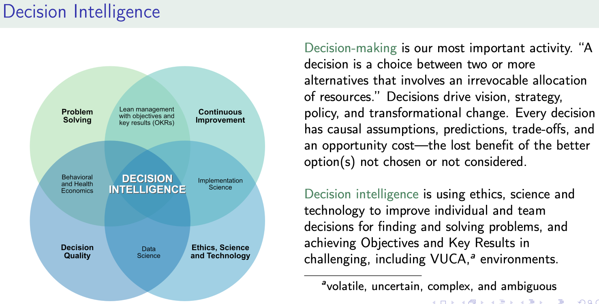
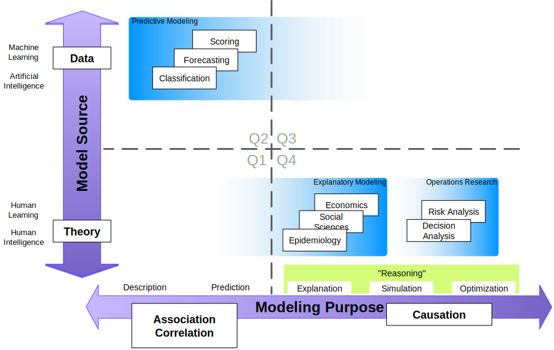

# CDPH is building a Decision Intelligence Unit

Tomás Aragón, MD, DrPH  
State Public Health Officer and Director  
California Department of Public Health  
[tomas.aragon@cdph.ca.gov](mailto:tomas.aragon@cdph.ca.gov) (email)  
https://drtomasaragon.github.io/ (blog)

We are hiring!

1. [Research & Analysis Section Supervisor (Research Scientist Supervisor II)](https://www.calcareers.ca.gov/CalHrPublic/Jobs/JobPosting.aspx?JobControlId=351392)
2. [Policy Research Scientist (Research Scientist III)](https://www.calcareers.ca.gov/CalHrPublic/Jobs/JobPosting.aspx?JobControlId=351382)
3. [Research & Analysis Epidemiologist (Research Scientist III)](https://www.calcareers.ca.gov/CalHrPublic/Jobs/JobPosting.aspx?JobControlId=351380)
4. [Decision Intelligence Unit Chief (Research Scientist Supervisor I)](https://www.calcareers.ca.gov/CalHrPublic/Jobs/JobPosting.aspx?JobControlId=349462)
5. [Behavioral Economist Implementation Scientist (Research Scientist III)](https://www.calcareers.ca.gov/CalHrPublic/Jobs/JobPosting.aspx?JobControlId=351381)
6. [Academic Partnerships Research Scientist (Research Scientist III)](https://www.calcareers.ca.gov/CalHrPublic/Jobs/JobPosting.aspx?JobControlId=351400)

[Decision-making is our most important activity](https://drtomasaragon.github.io/posts/2021-03-13-decision-intelligence01/).[^diblog] "A decision is a choice between two or more alternatives that involves an irrevocable allocation of resources." Decisions drive vision, strategy, policy, and transformational change. Every decision has causal assumptions, predictions, trade-offs, and an opportunity cost—the lost benefit of the better option(s) not chosen or not considered. Some decisions have extreme time constraints under deep uncertainty.

[^diblog]: Tomas Aragon (2021). Decision intelligence: An Introduction. Available from: [https://drtomasaragon.github.io/posts/2021-03-13-decision-intelligence01/](https://drtomasaragon.github.io/posts/2021-03-13-decision-intelligence01/)

Decision intelligence is using ethics, science, and technology to improve individual and team decisions for finding and solving problems, and achieving objectives and key results in challenging, including VUCA,[^1] environments (Figure 1).

[^1]: volatile, uncertain, complex, and ambiguous

The CDPH Office of Policy and Planning will have a Decision Intelligence Unit (DIU) to develop, implement, and improve strategic decision-making methods for high stakes, high cost, and high impact public health decisions. Methods will include cost-benefit and cost-effective analyses, and decision analysis. These positions have permanent funding. We will secure grants and develop collaborative partnerships with academic institutions. The major areas of initial focus, development, and collaboration will be

-	Decision making under uncertainty, including deep uncertainty (ie, risks not calculable)
-	Methods to optimize policy and regulatory decisions
-	[Computational algorithms for decision making](https://algorithmsbook.com/) (using Bayesian networks (including decision networks [influence diagrams]), Markov Decision Processes (MDPs), Partially Observable Markov Decision Processes (POMDPs), Reinforcement Learning, Agent-based modeling)
-	[Leaders as decision architects](https://hbr.org/2015/05/leaders-as-decision-architects):[^da] Design and improve of team decision meetings that incorporate cognitive psychology and behavioral economics

[^da]: John Beshears and Francesca Gino (2015). Leaders as Decision Architects: Structure your organization’s work to encourage wise choices. Harvard Business Review. Available from:  [https://hbr.org/2015/05/leaders-as-decision-architects](https://hbr.org/2015/05/leaders-as-decision-architects)

The DIU will have a trans-disciplinary team:

-	Health economist with expertise in population health cost-benefit and cost-effectiveness analyses
-	Behavioral economist with expertise in decision implementation science
-	Computational decision scientist with expertise in programming (Julia, Python, R)
-	Population health data scientist
-	Biostatistician

The DIU is part of CDPH's longer term strategy to build our capability in population health data science (Table) and to move us Levels 4 and 5.

|Level | Analysis | Description|
| :---: | --- | --- |
|1 | Description | a. surveillance and early detection of events|
| | | b. prevalence and incidence of risks and outcomes|
|2 | Prediction | a. early prediction and targeting of interventions|
|3| Explanation[^a] | a. discovery and testing of new causal pathways|
| | | b. estimation of intervention efficacy/effectiveness|
|4| Simulation | a. modeling for epidemiologic or decision insights|
|5| Optimization[^b] | a. optimizing decision, effectiveness, or efficiency metrics|

[^a]: Causal inference. See Judea Pearl. The Book of Why: The new science of cause and effect. Penguin 2019

[^b]: Decision analysis, cost-effectiveness/benefit analysis, mathematical modeling, operations research, etc.

Here is a graphical depiction of the Table.[^bayesialab] We aim to improve our "reasoning" to make better decisions.

[^bayesialab]: Source: https://www.bayesia.com/articles/#!bayesialab-knowledge-hub/1-introduction
